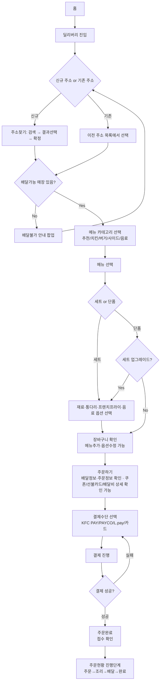
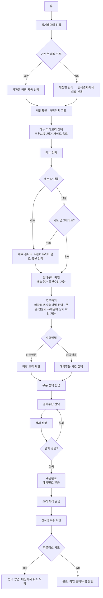
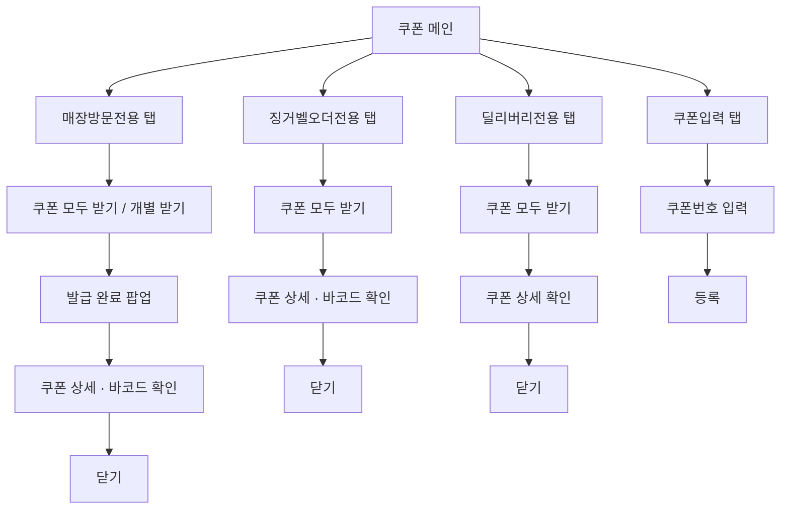
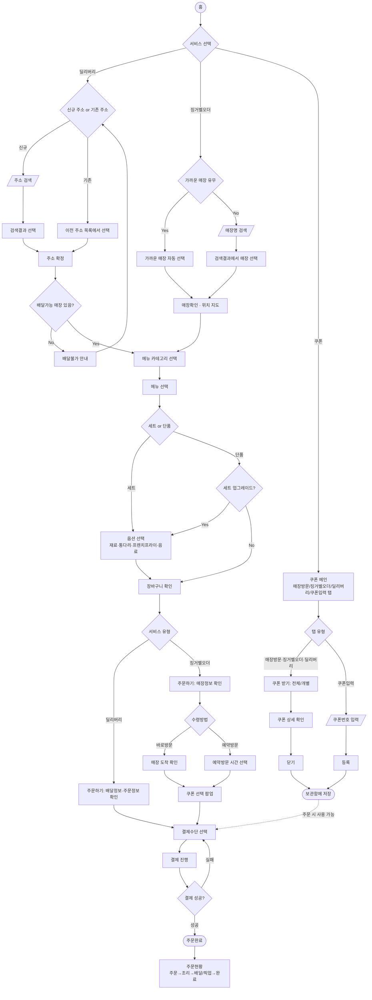

# KFC 앱 플로우차트 (딜리버리·징거벨오더·쿠폰·통합)

## 핵심 요약
팀원이 Miro에서 만든 상세 플로우를 참고해 분기·재시도 루프를 반영, 딜리버리/징거벨오더/쿠폰 3개 플로우와 이를 하나로 연결한 통합 플로우까지 mermaid로 정리한 자료. "4. 팀 내부 UI 리뷰노트" 문서 하단에 추가된 섹션으로, 쿠폰-주문 연결 단절(2순위 페인포인트)을 구조적으로 검증하는 근거 자료이기도 함.

## 출처
- Notion: [4. 팀 내부 UI 리뷰노트](https://app.notion.com/p/f1d7a6492f32822fa3fa81a95751806e) > 플로우차트 섹션

## 상세 내용

### 딜리버리

### 징거벨오더
딜리버리와 별개로 홈에서 바로 진입하는 독립된 흐름.

### 쿠폰

### 통합 플로우 (딜리버리·징거벨오더·쿠폰)
표준 순서도 도형(ANSI/ISO) 규칙 참고: 터미널(양끝 둥근 도형) = 시작/끝, 마름모 = 판단, 직사각형 = 처리, 평행사변형 = 입력/출력(검색·번호입력). `C_Stock -.주문 시 사용 가능.-> Pay` 구간이 점선인 것에 주목 — 쿠폰-주문 연결이 설계상 존재하지만 발견성이 낮다는 2순위 페인포인트의 구조적 근거.

